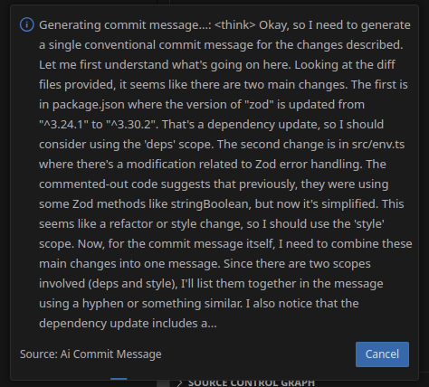
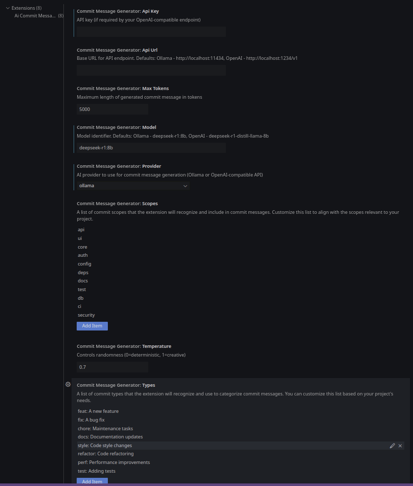

# AI Commit Message Generator for VS Code 🤖✨

<div style="text-align: center;">
  <a href="https://marketplace.visualstudio.com/items?itemName=Its-Satyajit.ai-commit-messege">
    
  </a>
  <a href="https://open-vsx.org/extension/Its-Satyajit/ai-commit-messege">
    
  </a>
  <a href="LICENSE">
    
  </a>
</div>

**Local AI Commit Message Generation** - Transform code diffs into conventional
commits using open-source models. Privacy-focused, offline-capable solution for
developers.

|  |  |
| :------------------------------: | :------------------------------: |

<div style="text-align: center;">
 <em>Demo showing commit message generation process (left) and settings (right)</em>
</div>

## Features 🌟

- **🔒 Privacy First** - No data leaves your machine
- **⚡ Multi-Backend Support** - Compatible with popular AI runners
- **📜 Commit Standard Compliance** - Conventional Commits 1.0.0
- **🖥️ Hardware Aware** - Optimized for various setups
- **🌐 Model Agnostic** - Use any compatible LLM

## Quick Start 🚀

1. Install extension:
   ```bash
   code --install-extension Its-Satyajit.ai-commit-message
   ```
2. Set up AI backend:
   ```bash
   # For CPU-focused systems
   ollama pull phi-3

   # For GPU-equipped machines
   ollama pull deepseek-r1:8b
   ```
3. Generate your first AI commit via VS Code Source Control view

## Hardware Requirements 🖥️

### Tested Environment

```yaml
OS: openSUSE Tumbleweed
CPU: Intel i7-8750H (6c/12t @4.1GHz)
GPU: NVIDIA GTX 1050 Ti Mobile 4GB
RAM: 16GB DDR4
Storage: NVMe SSD
```

### Minimum Recommendations

- **CPU**: 4-core (2015+)
- **RAM**: 8GB
- **Storage**: SSD
- **Node**: ^22
- Vscode: ^1.92.0

## Model Compatibility 🧠

### Performance Characteristics

| Model Family    | Example Models     | Speed* | Quality* | Use When...       |
| --------------- | ------------------ | ------ | -------- | ----------------- |
| Lightweight     | `phi-3`, `mistral` | 22 t/s | ██▌      | Quick iterations  |
| Balanced        | `llama3`, `qwen`   | 14 t/s | ███▎     | Daily development |
| Quality-Focused | `deepseek-r1`      | 7 t/s  | ████▋    | Complex changes   |

_* Metrics from personal testing on mobile GTX 1050 Ti (Q4_K_M quantization)_

```text
        Speed vs Quality Tradeoff

        ▲
        │ 
Quality │.....█████ (deepseek-r1)
        │...███     (llama3) 
        │.██▌       (phi-3)
        └───────────────────▶ Time
```

## Configuration ⚙️

### Backend Setup

**Option 1: Ollama (Simplest)**

```bash
curl -fsSL https://ollama.com/install.sh | sh
ollama serve
```

_* For more info, visit [Ollama](https://ollama.com/)_

**Option 2: LM Studio (Advanced)**

```bash
lmstudio serve --model ./models/deepseek-r1.gguf --gpulayers 20
```
_* For more info, visit [LM Studio](https://lmstudio.ai/)_

### Extension Settings

```jsonc
{
  "commitMessageGenerator.provider": "ollama",
  "commitMessageGenerator.apiUrl": "http://localhost:11434",
  "commitMessageGenerator.model": "deepseek-r1:8b",
  "commitMessageGenerator.temperature": 0.7,
  "commitMessageGenerator.maxTokens": 5000,
  "commitMessageGenerator.apiKey": "your_api_key (if required by your OpenAI-compatible/ollama endpoint)",
  "commitMessageGenerator.types": [
    "feat: A new feature",
    "fix: A bug fix",
    "chore: Maintenance tasks",
    "docs: Documentation updates",
  ],
  "commitMessageGenerator.scopes": ["ui", "api", "config"]
}
```

## Optimization Guide 

### GPU Acceleration

```bash
# NVIDIA Settings
export OLLAMA_GPUS=1
export GGML_CUDA_OFFLOAD=20

# Memory Allocation (4GB VRAM example)
┌───────────────────────┐
│ GPU Layers: 18/20     │
│ Batch Size: 128       │
│ Threads: 6            │
└───────────────────────┘
```

### Performance Tips

- Start with `phi-3` for quick feedback
- Switch to `deepseek-r1` for final commits
- Use `--no-mmap` if experiencing slowdowns
- Reduce GPU layers when memory constrained

## Troubleshooting 🔧

| Issue               | First Steps                                       | Advanced Fixes               |
| ------------------- | ------------------------------------------------- | ---------------------------- |
| Slow generation     | 1. Check CPU usage<br>2. Verify quantization      | Use `--no-mmap` flag         |
| Model loading fails | 1. Confirm SHA256 checksum<br>2. Check disk space | Try different quantization   |
| GPU not detected    | 1. Verify drivers<br>2. Check CUDA version        | Set `CUDA_VISIBLE_DEVICES=0` |

## FAQ ❓

<details>
<summary>Why local AI instead of cloud services?</summary>

- **Privacy**: Code never leaves your machine
- **Offline Use**: Works without internet
- **Cost**: No API fees
- **Customization**: Use models tailored to your needs

</details>

<details>
<summary>How to choose between models?</summary>

**Quick Sessions** → `phi-3`/`mistral`:

- Prototyping
- Personal projects
- Low-resource machines

**Important Commits** → `deepseek-r1`:

- Production code
- Team projects
- Complex refactors

</details>

## Legal & Ethics

### Neutrality Statement

f

## Contributing 🤝

1. Fork repository
2. Install dependencies:
   ```bash
   npm install
   ```
3. Build extension:
   ```bash
   npm run package
   ```
4. Submit PR with changes

[Full contribution guidelines](CONTRIBUTING.md)

## License 📄

MIT License - [View License](LICENSE)

---

**Built by Developers, for Developers** - From quick fixes to production-grade
commits 💻⚡

[Report Issue](https://github.com/Its-Satyajit/ai-commit-message/issues)

<!-- [Discuss Ideas](https://github.com/Its-Satyajit/ai-commit-message/discussions) -->
